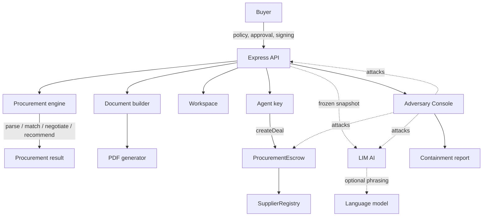

# Limen

**An AI procurement agent whose spending authority is enforced by a smart contract, not by application code.**

Limen sources physical goods, screens suppliers, negotiates against floor prices it cannot see, and brings back one deal. Then it stops, because the money is not its to spend.

> The agent can negotiate a deal. It cannot change how much it is allowed to spend.

That sentence is the whole product. Everything below is either a demonstration of it or an honest note about where it stops.

**Limen Live demo:** https://limen-peqe.onrender.com

**Limen Technical Document:** https://drive.google.com/file/d/1H9PaUsXk27513PG4hHXv6unZhksCMLL6/view?usp=sharing (also available in /Docs)

**Limen Pitch Deck:** https://drive.google.com/file/d/1IPKUzLFwctSXWlkNx4Hnlh1PlJFWyHJ1/view?usp=sharing (also available in /Docs)

> The hosted demo runs on a free instance and can take up to a minute to wake from sleep. Local startup takes around fifteen seconds.

---

## Contents

- [The problem](#the-problem)
- [How it works](#how-it-works)
- [Running it](#running-it)
- [The three desks](#the-three-desks)
- [Guided demo](#guided-demo)
- [Architecture](#architecture)
- [Where the AI sits, and where it does not](#where-the-ai-sits-and-where-it-does-not)
- [Smart contracts](#smart-contracts)
- [Payments and Razorpay](#payments-and-razorpay)
- [Security model](#security-model)
- [Adversary Console](#adversary-console)
- [Testing](#testing)
- [Deployment](#deployment)
- [Environment variables](#environment-variables)
- [What this build does not do](#what-this-build-does-not-do)
- [Roadmap](#roadmap)
- [Author](#author)

---

## The problem

Give an autonomous agent a budget and you are trusting three things at once: the model, the prompt, and every line of code between them and the payment rail. Any of the three can fail. Prompts leak. Models get injected. Application checks get refactored around at four in the afternoon by somebody who did not know what that `if` statement was load bearing for.

The usual answer is a better prompt or another validation layer. Both live inside the same trust boundary as the thing being constrained, which is the part that does not work.

Limen puts the limit somewhere the agent cannot reach. The buyer publishes a per-deal ceiling into an escrow contract. The agent may attempt any purchase it likes. The contract is what refuses.

Instruct it to overspend by fifty dollars and the transaction reverts with `ExceedsPerDealCap`. Instruct it to raise its own ceiling first and that reverts too, because the policy record keys off the message sender and an agent can only ever write its own policy. Escalation is not a check that might be missed. It cannot be expressed.

---

## How it works

A buyer describes what they need in plain language:

```text
500 kg bottle-grade PET resin
Budget: $1,200
Delivery: within 14 days
Certification: FDA food-contact
```

Limen then:

1. Parses the request into hard constraints and soft preferences.
2. Screens the catalogue and disqualifies anything failing a hard constraint.
3. Negotiates with the survivors, against floor prices it is never shown.
4. Walks away rather than exceed the stated budget.
5. Recommends one deal, with the reasoning for every exclusion.
6. Builds a purchase agreement from canonical server state.
7. Stops, and waits for a person.

Nothing on-chain happens before a human approves. The seeded catalogue holds fifteen suppliers across thirteen countries offering thirty-nine listings in thirteen materials, and seventeen worked scenarios ship with the app across packaging, metals, mechanical, electrical, electronics, medical and aerospace buying.

---

## Running it

You need Node.js 18 or newer. Nothing else. No database, no wallet, no faucet, no second terminal.

```bash
git clone https://github.com/sujal128005/limen.git limen
cd limen
npm install
npm start
```

Then open http://localhost:4000

The first boot compiles the contracts with solc, deploys three of them to an in-process EVM, and registers fifteen suppliers on chain. That takes a few seconds and is why the startup log is worth reading: it tells you which chain you are on, whether state is durable, and which payment rails are live.

### Every command

| Command | What it does |
| --- | --- |
| `npm start` | Builds the frontend, then runs the server on port 4000 |
| `npm run dev` | Runs the server without rebuilding the frontend |
| `npm run dev:web` | Vite dev server for frontend work, with hot reload |
| `npm run build:web` | Builds the frontend only |
| `npm test` | 316 unit and contract tests. No server needed |
| `npm run sweep` | 154 checks against a running server |
| `npm run verify:ui` | 70 checks in a real browser |
| `npm run verify:tier4` | 20 more, including contrast in both themes |
| `npm run adversary` | Runs the Adversary Console against a running server; human-readable table |
| `npm run adversary -- --ci` | Same, machine-readable, non-zero exit on any breach — used in CI |
| `npm run check:razorpay` | Reports whether the payment gateway is configured |
| `npm run build:docs` | Rebuilds the pitch deck and technical document as PDFs |
| `npm run deploy` | Deploys the contracts to an external EVM network |

---

## The three desks

A purchase passes through three pairs of hands. Nobody holds two of raising, approving and paying.

| Desk | Code | Holds |
| --- | --- | --- |
| Sales and Procurement | `2481` | Runs the sourcing, submits, confirms receipt |
| Head of Operations | `7390` | Publishes the policy, approves or rejects, funds escrow |
| Finance and Payments | `5162` | Releases the payment, and nothing else |

Four digits, with the sign-in route throttled: five free attempts, then a delay that doubles to a five minute cap. Short codes without that throttle would be no codes at all, so the two shipped together.

These are published codes for a demo anyone can open. Set `LIMEN_ROLE_CODES` to replace them and the sign-in screen stops displaying them. See [Security model](#security-model) for what this does and does not claim.

To walk the whole flow on one machine, sign in as one desk, do its part, then use **Switch desk** in the top bar. The workspace is the same. The permissions are not.

---

## Guided demo

1. Choose **Try the demo workspace**, then sign in as Sales with `2481`.
2. Keep the pre-filled request and press **Run sourcing**.
3. Watch the screening and the negotiation rounds.
4. Review the recommendation, submit it, send it to the head.
5. Switch desk. Sign in as Head with `7390`.
6. Approve and sign the agreement, then publish the spending policy.
7. Now make the agent try to spend **$1,250** against a **$1,200** ceiling.
8. The transaction reverts with `ExceedsPerDealCap`.
9. Let the agent raise its own policy first, then try again.
10. The buyer's ceiling still applies.
11. Fund the valid deal. Switch back to Sales and confirm receipt.
12. Switch to Finance with `5162` and release the payment.

Two moments are worth watching. **Changing the agent's own policy does not change the buyer's ceiling**, which is the security claim, demonstrated rather than asserted. And at every step the screen names the desk that has to act next, so a desk is never shown a control it cannot use.

For the same claims proven automatically, and against every boundary in the system rather than one, see [Adversary Console](#adversary-console) below.

---

## Architecture



| Component | Responsibility |
| --- | --- |
| `server/engine/` | Requirement parsing, supplier matching, negotiation, recommendation |
| `server/authorization.js` | Which desk may act, and what comes next |
| `server/identity.js` | Desk codes and signed role tokens |
| `server/documents.js` | Purchase and settlement documents, from canonical state |
| `server/pdf.js` | PDF binaries, via pdfkit |
| `server/counsel.js` | LIM AI. Has no capability to execute anything |
| `server/summary.js` | The boundary between phrasing a figure and computing one |
| `server/checkout.js` | Razorpay Checkout, money into the payment float |
| `server/payments.js` | Razorpay Payouts, money out to the supplier |
| `server/workspace.js` | Server-side workspace isolation |
| `server/adversary/` | Attack registry, shadow-workspace runner, evidence capture, containment report |
| `server/routes/adversary.js` | Adversary Console API |
| `contracts/` | `ProcurementEscrow`, `SupplierRegistry`, `MockUSDC` |

---

## Where the AI sits, and where it does not

Limen separates deciding from phrasing, and the separation is enforced in code.

**The engine decides.** Supplier eligibility, prices, negotiation outcomes, the recommendation, every figure on every document. All deterministic, all derived from canonical server state.

**The model phrases.** A grounded result can be handed to an OpenAI-compatible model to read more naturally. Before that phrasing reaches a screen it is checked in both directions against the deterministic text: a rewrite that drops a figure is rejected, and so is one that introduces a figure that was never there. Comparison is by numeric value, so `$1,175.00` and `$1,175` are the same number, and an invented "a saving of 12%" is not.

If the model is unavailable, slow, malformed or refuses, the grounded text ships instead and the interface says which one you are reading.

| Condition | Reported as |
| --- | --- |
| No API key | `no-key` |
| Timeout over 8s | `timeout` |
| HTTP error | `http-<status>` |
| Network failure | `network` |
| Invalid completion | `malformed-completion` |
| Model refusal | `refusal-not-sent` |

**LIM AI** answers questions about a run from a frozen snapshot of it. It repairs typos before classifying, so "whyy ws ths supllier choosen" is answered and "increse the limit" is still refused. It cannot sign, approve, move funds or change a limit, and that is enforced by its import list rather than by an instruction in a prompt. A module with no capability imports has no capability. This is the exact claim the Adversary Console's D-class attacks probe directly, including one that statically parses the import graph rather than just testing behaviour.

```bash
node scripts/llm-check.js            # latency and failure modes
node scripts/llm-check.js --models   # list available models
```

---

## Smart contracts

### `ProcurementEscrow`

Holds the buyer's spending ceiling, agent authorisation, deal creation, escrow settlement and access control. The ceiling is enforced inside `createDeal`, and a request above it reverts with `ExceedsPerDealCap`.

Settlement requires two signatures: `attestShipment` from the supplier's own key, then `confirmDelivery` from the buyer. The contract refuses the second without the first.

The Adversary Console's A-class attacks call this contract directly — including trying to raise the agent's own policy first — and capture the decoded revert as proof.

### `SupplierRegistry`

Supplier reputation, with writes restricted to the escrow contract.

### `MockUSDC`

A local six-decimal ERC-20 for the demo.

---

## Payments and Razorpay

Two different things move money here, and conflating them is the fastest way to misread the project.

The **on-chain escrow, in USDC**, is the authority mechanism. It refuses a spend above the published ceiling. It is not a bank account.

The **payment float, in INR**, is money at a payment provider. It is what a supplier is actually paid from. The contract governs whether a payment is allowed. The float governs whether it can be made.

Razorpay sits on both sides of that float.

| Direction | Product | Where it appears |
| --- | --- | --- |
| Money in | Razorpay Checkout | Finance desk, **Add funds**, tops up the float |
| Money out | Razorpay Payouts | Settlement, pays the supplier from the float |

Checkout charges a customer and does not disburse to a vendor, so using it to pay a supplier would misrepresent what happens at settlement. Using it to fund the account the supplier is later paid from is exactly what it is for.

### The rule this is built around

**A payment is confirmed by the server verifying a signature, never by the browser reporting success.** Razorpay's checkout handler runs in the page, and a page can be edited, so the handler's word is a claim and the HMAC over `order_id|payment_id` is the proof. Nothing credits the float until that check passes, and the key secret that computes it never leaves the server.

Without credentials the app runs a local stand-in, clearly labelled as one. The stand-in signs its confirmations the same way and they are verified by the same function, so the check that matters is exercised whether or not anyone has configured a key. The two modes do not accept each other's signatures: the local secret is in this repository, and if it verified in live mode it would be a way to credit the float for free.

The Adversary Console's F-class attacks target exactly this boundary: a forged confirmation, a replay of a valid one, a stand-in signature presented in live mode, and a browser-claimed success with no signature at all.

### Turning the gateway on

Take a **test** key pair from the Razorpay Dashboard under Account and Settings, API Keys, and put it in `.env`:

```bash
RAZORPAY_KEY_ID=rzp_test_xxxxxxxxxxxx
RAZORPAY_KEY_SECRET=xxxxxxxxxxxxxxxxxxxxxxxx
```

Restart the server, since credentials are read once at startup. Then confirm it took:

```bash
npm run check:razorpay              # is the pair configured
npm run check:razorpay -- --order   # and does Razorpay accept it
```

The preflight never prints the key secret. `.env` is git-ignored, and the secret should stay out of commits, screenshots and chat windows.

### The two rails are configured separately

Checkout needs a key pair. Payouts is RazorpayX and additionally needs `RAZORPAY_ACCOUNT_NUMBER` to pay from and a `RAZORPAY_FUND_ACCOUNTS` entry per supplier, because a fund account is a real record against verified bank details and there is no honest way to invent one for a demo supplier.

So configuring Checkout turns Checkout on and leaves settlement on the local rail, which is the right default for a demo. The server prints both rails at startup:

```text
money in:  Razorpay Checkout, key rzp_test_xxxxxxxxxxxx
money out: local rail, RAZORPAY_ACCOUNT_NUMBER is not set
```

---

## Security model

Limen is built on the assumption that the agent will eventually behave incorrectly. Every row below is now backed by an attack in the [Adversary Console](#adversary-console) rather than asserted on its own.

<<<<<<< HEAD
| Protection | Enforced by | Attack |
=======
| Protection | Enforced by | Adversary attack |
>>>>>>> 5ccbdf2 (Add Security Observatory verification layer)
| --- | --- | --- |
| Spending ceiling | `ProcurementEscrow.createDeal` | A1 |
| Agent cannot raise the buyer's ceiling | Separate buyer and agent policies, keyed on `msg.sender` | A2 |
| Only the authorised agent can spend | `NotAuthorisedAgent` | A3 |
<<<<<<< HEAD
| Reputation writes | `SupplierRegistry`, restricted to the escrow | A5 |
| Catalogue and free-text content cannot alter engine output | Deterministic engine, `server/engine/` | B1, B2 |
| Floor prices never reach the client | Response serialisation, checked across every API surface | B3 |
| Document values | Derived from server-side canonical state | G1 |
| Workspace isolation | `server/workspace.js` | G2 |
| LIM AI cannot execute actions | No capability imports in `server/counsel.js` | D2 |
| The model cannot introduce a figure | Two-way numeric check in `server/summary.js` | C1, C2, C4 |
| Role cannot be chosen by the caller | HMAC-signed token, role read back out of the signature | E1, E2 |
| A desk cannot be entered by picking it | Per-desk code in `server/identity.js`, throttled in `server/doorlock.js` | E4 |
| A delivery needs two signatures | `attestShipment` by the supplier, `confirmDelivery` by the buyer | A4 |
| A payment is real, not claimed | HMAC verified server-side in `server/checkout.js` | F1, F2, F4 |
=======
| A delivery needs two signatures | `attestShipment` + `confirmDelivery` | A4 |
| Reputation writes require escrow settlement | `SupplierRegistry`, restricted to the escrow | A5 |
| Catalogue injection does not alter engine verdicts | Engine operates on parsed numeric values | B1 |
| Request injection does not inflate budget | Deterministic parser ignores authority claims | B2 |
| Supplier floor prices never exposed | Whitelist projection in `counsel.buildSnapshot` | B3 |
| Model cannot drop a figure | Two-way numeric check in `server/summary.js` | C1 |
| Model cannot introduce a figure | Same check, opposite direction | C2 |
| Adversarial counsel phrasings refused | Clause-by-clause pattern match in `server/counsel.js` | D1 |
| LIM AI cannot execute actions | No capability imports in `server/counsel.js` | D2 |
| Role cannot be chosen by the caller | HMAC-signed token, role read back out of the signature | E1, E2 |
| A desk cannot be used beyond its permissions | Role capability check in `server/identity.js` | E3 |
| A desk cannot be entered by guessing | Per-desk code throttled in `server/doorlock.js` | E4 |
| A payment is real, not claimed | HMAC verified server-side in `server/checkout.js` | F1, F4 |
| No double credit on replay | Payment confirmation is idempotent | F2 |
| Document values | Derived from server-side canonical state only | G1 |
| Workspace isolation | `server/workspace.js` + token workspace binding | G2 |
>>>>>>> 5ccbdf2 (Add Security Observatory verification layer)

The API is not the final authority on the spending limit. The contract is.

The desk codes deserve precision. They stop the wrong browser tab from becoming the approver, which is the mistake that actually happens when one person walks through all three desks. They are not an identity system and do not claim to be: the demo codes are published in this file, and even when replaced they are shared secrets with no accounts behind them. What does not depend on them is the separation itself. The role travels in a signed token, every restricted route re-checks it, and the ceiling is enforced by the contract regardless of who holds what.

---

## Adversary Console

<<<<<<< HEAD
Every row in the table above used to be a claim. The Adversary Console is what turns it into a result you can run yourself.

It is a red-team harness that attacks Limen's own running system — real contract calls, real Express routes, real HMAC checks, real engine functions, nothing mocked — and reports, for each attempt, whether the system stayed contained and **which layer** refused it: the smart contract, the server, or the code's own structure.

It was built with IBM Project Bob, which first read the repository and produced `docs/ATTACK_SURFACE.md`: every place Limen refuses an action, and which of those places had no test behind them. That map is what the attacks below were built from.

### What it attacks

| Class | Targets | Attacks |
| --- | --- | --- |
| A — on-chain authority | The escrow contract directly: ceiling, self-policy escalation, unauthorised agents, the two-signature settlement, reputation writes | A1–A5 |
| B — injection | Poisoned supplier listings, free-text requests carrying fake instructions, attempts to read a floor price off any response surface | B1–B3 |
| C — phrasing boundary | Whether model phrasing can drop or invent a figure, and whether every failure mode ships the grounded text honestly | C1–C5 |
| D — capability escalation | Whether LIM AI can be talked into acting, in ten adversarial phrasings, plus a structural check of its import graph | D1–D2 |
| E — identity and role | Forged tokens, stripped or malformed signatures, cross-desk privilege, the sign-in throttle's backoff curve | E1–E4 |
| F — money | Forged payment confirmations, replay, a stand-in signature presented as a live one, a browser claiming success with no signature | F1–F4 |
| G — state integrity | Client-supplied figures overriding a document, one workspace reading another's data | G1–G2 |

Twenty-one attacks in total. Some are skipped rather than run, and that is correct behaviour rather than a gap: the C-class attacks need `LLM_API_KEY` set to exercise model phrasing at all, and F3 needs live Razorpay credentials, matching how the rest of the app already treats unconfigured features.

### Isolation

Every run happens inside a disposable shadow workspace, seeded from a snapshot of the caller's real one and torn down afterward. An attack can try to overspend, forge a token, or cross into another workspace, but it cannot touch a real purchase, policy, escrow deal, payment float or document. `test/adversary.test.js` asserts this directly: it hashes the real workspace state before and after a full run and checks nothing moved.
=======
The Adversary Console is a red-team harness that attacks Limen's own running system and proves, with raw evidence, which layer refused each attack. It ships with the product rather than sitting in a separate repository, because a containment claim that is never tested is a claim that drifts.

### What it attacks

Twenty-five attacks across seven classes: on-chain authority, injection into the decision path, the phrasing boundary, capability escalation via LIM AI, identity and role, money, and state integrity. Each attack targets a real code path — real contract calls, real Express routes, real HMAC verification, real engine functions.

Every run creates an isolated shadow workspace, seeds it from a snapshot of the standard catalogue, and tears it down after. No real purchase, policy, escrow deal, payment float or document is mutated.

### What a contained result proves

A CONTAINED result means this specific build resisted the specific attack as implemented, running against a simulated catalogue and an in-process EVM. It is evidence about this code at this commit. It is not a security audit and does not claim to be.

The on-chain boundary is the hardest: the EVM enforces it and the harness cannot weaken it. The server boundary is correct in this build; a future change that removes a guard would be caught by the harness in CI because it is a regression gate. The structural boundary (no dangerous imports in `server/counsel.js`, document values from canonical state only) is verified by static analysis and is the most future-proof.
>>>>>>> 5ccbdf2 (Add Security Observatory verification layer)

### Running it

```bash
<<<<<<< HEAD
npm start                # in one terminal
npm run adversary        # in another: human-readable table, one row per attack
npm run adversary -- --ci   # machine-readable, non-zero exit on any breach
```

Or from the app itself: sign in to any desk and open the **Adversary** screen. Run All streams each attack's status live, groups results by class, and shows a boundary map of which layer refused what — contract-enforced refusals are shown as the strongest evidence, because that is the actual product claim. Opening any attack's evidence drawer shows the hypothesis, the expected and observed result, and the raw proof: a decoded revert selector, an HTTP status and body, a computed-versus-supplied HMAC, or a field-level diff. **Download Containment Report** renders the same run as a PDF, built through the existing `server/pdf.js` from canonical run state, the same way every other document in the app is built.

Current containment score: **run `npm run adversary` and see for yourself** — that is the point of the tool. As of the last local run this surfaced real findings, not a clean pass, including a floor price leaking through one API response and a workspace boundary missing on one route. Fixes for genuine findings are tracked as they land; a finding that turns out to be an attack aimed at the wrong route gets the attack corrected instead, never softened.

### A harness that can prove it isn't a rubber stamp

A red-team suite that always says PASS is worthless. `test/adversary.test.js` includes a meta-test that deliberately weakens a real check inside the test itself and asserts the harness reports a breach. If the harness ever stops noticing, that test fails first.

### Continuous containment

`.github/workflows/containment.yml` runs on every push and pull request: install, `npm test`, start the server, `node scripts/adversary.js --ci`, upload the Containment Report as a build artifact, and fail the job on any breach. The point is the same one the whole project is built around — a protection that isn't checked isn't a protection, it's a comment. This makes that true for the Adversary Console's own findings as well: if a future refactor quietly removes a load-bearing check, the build fails instead of the gap sitting undiscovered until a demo.

### What this proves, and what it does not

A contained result is evidence about this build, run against a simulated catalogue and an in-process EVM by default. It is not a security audit, and the Containment Report says so in its own honest-limits section rather than leaving that to a reader's assumptions.

The console is not yet wired into `npm run sweep` or `npm run verify:ui` — see [Roadmap](#roadmap).
=======
npm start                          # server running in one terminal

npm run adversary                  # human-readable console table
npm run adversary -- --ci          # machine-readable, non-zero exit on breach
npm run adversary -- --attacks A1  # single attack
```

The Adversary screen is also available in the UI navigation from any desk.

### Reading the report

The Containment Report PDF (available from the UI and uploaded as a CI artefact) has five sections:

1. **Run metadata** — timestamp, desk, chain id, storage type, payment rails, commit sha
2. **Containment score** — n/m contained, coloured red if any breach
3. **Per-attack table** — id, class, verdict, enforcement layer, latency
4. **Evidence appendix** — hypothesis, expected, observed, and the raw proof artifact for each attack
5. **Honest limits** — what this result does and does not prove, and which attacks were skipped and why

A breach in the report means a boundary that should hold did not. Do not suppress it. The harness is designed to be a regression gate: if a future refactor removes a load-bearing check, CI catches it here.
>>>>>>> 5ccbdf2 (Add Security Observatory verification layer)

---

## Testing

```bash
npm test                 # 316 unit and contract tests, no server needed

npm start                # in one terminal
npm run sweep            # in another: 154 checks against the live HTTP API
npm run verify:ui        # and 70 checks in a real browser
npm run verify:tier4     # and 20 more, including contrast in both themes
npm run adversary        # 21 attacks against every enforcement boundary, isolated in a shadow workspace

node scripts/e2e.js      # one full purchase, end to end
node scripts/llm-check.js
```

The two browser suites need a browser, so they are not part of `npm test`:

```bash
npm install --no-save playwright-core
```

`scripts/browser.js` then finds something to render with: an installed Chrome or Edge on Windows and macOS, or `@sparticuz/chromium` on Linux, which you can add with `npm install --no-save @sparticuz/chromium`. If none is found it prints what to install rather than failing inside a spawn call. Set `LIMEN_CHROME` to a full executable path to override the search.

On Windows, `@sparticuz/chromium` alone is not enough. It ships a Linux build for AWS Lambda, and pointing Playwright at it produces `spawn ...\Temp\chromium ENOENT`. Installing Chrome, which most machines already have, is the fix.

They exist because a previous round of defects passed every other check. Three nav items had no screen behind them, the approver was shown nothing to decide on, and the run stepper read a browser variable instead of the purchase. All three are questions about what is drawn, and nothing that talks to the API can see them.

**With Razorpay credentials configured**, `sweep`, `verify:ui` and `verify:tier4` stop with an explanation instead of running. All three fund the payment float to reach settlement, and once Checkout is live they cannot: a real order is paid with a card, by a person, in a browser. The server withholds the stand-in payment in live mode on purpose, because handing one out would let any page skip the gateway and credit itself. For a full run, comment out `RAZORPAY_KEY_ID` and `RAZORPAY_KEY_SECRET` and restart. `npm test` needs no toggling and covers both modes. `npm run adversary`'s F3 attack follows the same rule: it skips cleanly rather than failing when live credentials are set.

---

## Deployment

`render.yaml` is a working Render blueprint. If you deploy by hand instead, the two commands are:

| Setting | Value |
| --- | --- |
| Build command | `npm install && npm run build:web` |
| Start command | `node server/index.js` |
| Health check path | `/api/status` |
| Node version | `20` |

The frontend is built once at build time rather than at start time. `npm start` would rebuild it on every cold start through the `prestart` hook, which on a free instance means paying for a Vite build every time the service wakes.

This runs a persistent Node process on purpose. The chain is an in-process EVM, so a serverless target cannot host it: there is no process to keep the chain alive between requests.

Set `DATABASE_URL` to any Postgres if you want state to survive a restart, and `LIMEN_SESSION_SECRET` so a restart does not sign all three desks out mid-demo. Everything else is optional.

`.github/workflows/containment.yml` runs alongside deployment as a CI gate; it does not itself deploy anything.

---

## Environment variables

Limen runs with none of them set.

| Variable | Default | Description |
| --- | --- | --- |
| `PORT` | `4000` | Application port |
| `LLM_API_KEY` | not set | Enables model-based phrasing |
| `LLM_BASE_URL` | `https://api.x.ai/v1` | OpenAI-compatible endpoint |
| `LLM_MODEL` | `grok-3-mini` | Model used for phrasing |
| `DATABASE_URL` | in-memory | Postgres, for state that survives a restart |
| `LIMEN_SESSION_SECRET` | random per boot | Signs role tokens, survives restarts |
| `LIMEN_ROLE_CODES` | published demo codes | Per-desk sign-in codes, as JSON |
| `RPC_URL` | not set | External EVM JSON-RPC endpoint |
| `DEPLOYER_KEY` | not set | Required when using `RPC_URL` |
| `AGENT_KEY` | not set | Agent account on a public network |
| `LIMEN_BUYER_MNEMONIC` | not set | Derives one buyer wallet per workspace |
| `RAZORPAY_KEY_ID` | not set | Razorpay Checkout, money in |
| `RAZORPAY_KEY_SECRET` | not set | Signs and verifies payments |
| `RAZORPAY_ACCOUNT_NUMBER` | not set | Required for payouts, money out |
| `RAZORPAY_FUND_ACCOUNTS` | `{}` | Supplier id to fund account id, as JSON |
| `RAZORPAY_WEBHOOK_SECRET` | not set | Verifies payout webhooks |
| `LIMEN_USD_INR` | `85` | Stated USD to INR rate. Not a live feed |
| `LIMEN_CHROME` | not set | Full path to a Chrome or Edge binary, for the rendered suites |
| `LIMEN_SUPPLIER_FILE` | seeded catalogue | A JSON file of suppliers |
| `LIMEN_SUPPLIER_URL` | seeded catalogue | An https endpoint returning the same JSON |
| `LIMEN_SUPPLIER_TOKEN` | not set | Bearer token for that endpoint |
| `LIMEN_NOTIFY_WEBHOOK` | not set | Posted when a purchase lands on a desk |
| `LIMEN_PUBLIC_URL` | not set | Used to link back from a notification |

```bash
cp .env.example .env
```

Never put a real credential in `.env.example`.

---

## What this build does not do

Being clear about this is part of the point. A product about honest authority should be honest about its own edges.

- **The e-signature** records a name, a timestamp and a document hash. It is not a legally binding electronic signature.
- **The chain** is an in-process EVM by default rather than a public network. `RPC_URL` connects it to one, such as Base Sepolia.
- **Suppliers** are seeded unless `LIMEN_SUPPLIER_URL` or `LIMEN_SUPPLIER_FILE` points at a real directory. Negotiation behaviour is simulated.
- **Delivery.** Settlement needs two signatures and the contract refuses the second without the first. Be precise about what that buys: it moves a fictitious delivery from something one party can do alone to something two parties must agree on. It does not remove it. A buyer and supplier acting together can still settle a deal that never moved. Closing that needs an attestation from somebody with no stake in the trade, which is a carrier or inspector integration, and therefore a partnership rather than a sprint.
- **Currency.** Purchases and the escrow are in USD, the payment rail is in INR, and the conversion uses a stated constant rather than a live rate (`LIMEN_USD_INR`, default 85). Every screen showing a converted figure names the rate, and the rate is stored on the payment record so a conversion can be checked later against the number actually used. `server/fx.js` is shaped for a real feed to be substituted in.
- **The desk codes** are not an identity system, and a real deployment replaces `server/identity.js` with its own sign-in.
- **The Adversary Console** attacks a simulated catalogue and an in-process EVM by default. A contained result is evidence about this build, not a security audit, and it is not yet wired into `npm run sweep` or `npm run verify:ui`.

---

## Roadmap

1. **Third-party delivery attestation.** Two signatures narrowed the problem. They did not close it.
2. **A real identity provider** in place of the desk codes.
3. **Supplier-side agents**, so both sides of the negotiation are autonomous.
4. **Additional procurement verticals.**
5. **Email notifications** alongside the webhook.
6. **Wire the Adversary Console into `npm run sweep` and `npm run verify:ui`**, so containment is checked from both the API and the browser, not only from its own CLI and UI.
7. **Close remaining Adversary Console findings.** See `docs/ATTACK_SURFACE.md` and the latest Containment Report for what is still open.

---

## Author

Built by **Sujal Negi**, a student at IIITDM Kurnool.

[sujalnegi.tech](https://sujalnegi.tech)

Further architecture and implementation notes are in `docs/Limen_Technical_Documentation.pdf`, and the pitch deck is `docs/Limen_Pitch_Deck.pdf`.

---

## License

MIT. See [LICENSE](LICENSE).
