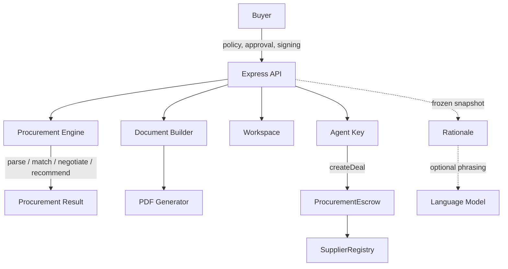

# Limen

**AI procurement agent with on-chain spending controls.**

Limen helps businesses source physical goods, compare suppliers, negotiate prices, and execute purchases while keeping the spending limit outside the agent's control.

The core idea is simple:

> **The agent can negotiate a deal, but it cannot change how much it is allowed to spend.**

Limen combines deterministic procurement logic, optional LLM assistance, and smart-contract-enforced spending limits.

The seeded catalogue holds **15 suppliers across 13 countries, offering 39 listings in 13 materials**, from PET resin and kraft paper through aluminium, steel, copper and silicone. **17 worked scenarios** ship with the app, spanning packaging, metals, mechanical, electrical, electronics, medical and aerospace buying.

**Live demo:** https://covenant-j1op.onrender.com

> The hosted demo runs on a free instance and may take up to a minute to wake from sleep. Local startup takes around 15 seconds.

---

## What Limen does

A buyer gives Limen a sourcing request such as:

```text
500 kg bottle-grade PET resin
Budget: $1,200
Delivery: within 14 days
Certification: FDA food-contact
```

Limen then:

1. Parses the requirements.
2. Screens suppliers against the request.
3. Rejects suppliers that fail mandatory requirements.
4. Negotiates with eligible suppliers.
5. Walks away when a negotiation exceeds the buyer's budget.
6. Recommends the best available deal.
7. Generates a purchase agreement from canonical server state.
8. Requires buyer approval before payment.
9. Executes the purchase through the escrow contract.
10. Records the settlement and supplier reputation on-chain.

The LLM is used for **phrasing**, not for deciding prices, eligibility, spending limits, or settlement figures.

---

## Try it locally

### Requirements

* Node.js 18+
* Nothing else

### Run

```bash
git clone https://github.com/sujal128005/limen.git limen
cd limen
npm install
npm start
```

Then open:

```text
http://localhost:4000
```

There is no separate database, wallet, faucet, or second terminal required for the local demo.

### The three desks

A purchase passes through three pairs of hands, and each has its own sign-in
code. Nobody holds two of raising, approving and paying.

| Desk                   | Code         | Does                                              |
| ---------------------- | ------------ | ------------------------------------------------- |
| Sales / Procurement    | `2481` | Runs the sourcing, submits, confirms receipt     |
| Head / Manager         | `7390` | Publishes the policy, approves or rejects, funds |
| Finance / Payments     | `5162` | Releases the payment, and nothing else           |

Four digits, with the login route throttled: five free attempts, then a delay
that doubles to a five minute cap. Short codes without that throttle would be
no codes at all, so the two shipped together.

These are published codes for a demo anyone can open. Set `LIMEN_ROLE_CODES` to
replace them, and the sign-in screen stops displaying them. See
[Security model](#security-model) for what this does and does not claim.

To walk the whole flow on one machine, sign in as one desk, do its part, then
use **Switch desk** in the top bar. The workspace is the same; the permissions
are not.

### Quick demo

1. Select **Try the demo workspace**, then sign in as **Sales** with `2481`.
2. Keep the pre-filled sourcing request and click **Run sourcing**.
3. Follow the supplier screening and negotiation.
4. Review the recommended deal, then submit it and send it to the head.
5. Switch desk. Sign in as **Head** with `7390`.
6. Approve and sign the agreement, then publish the spending policy.
7. Try to make the agent spend **$1,250** against a **$1,200** ceiling.
8. The transaction reverts with `ExceedsPerDealCap`.
9. Let the agent increase its own policy and try again.
10. The buyer's $1,200 ceiling still applies.
11. Fund the valid deal. Switch back to **Sales** and confirm delivery.
12. Switch to **Finance** with `5162` and release the payment.

Two things are worth watching. **Changing the agent's own policy does not change
the buyer's spending ceiling**, which is the security claim. And at every step
the screen names the desk that must act next, so a desk that cannot do something
is never shown the control for it.

---

## Why the spending limit matters

An autonomous procurement agent may eventually be exposed to bad data, prompt injection, bugs, or a compromised model.

Limen therefore does not rely on the agent behaving correctly to enforce the budget.

There are two separate identities:

* **Buyer**: controls the spending ceiling.
* **Agent**: negotiates and executes purchases within that ceiling.

The contract enforces the final authority.

```text
Buyer
  │
  │ spending policy
  ▼
ProcurementEscrow
  │
  │ authorised purchase
  ▼
Agent
```

The agent can modify its own policy, but it cannot modify the buyer's ceiling.

---

## Architecture



### Main components

| Component             | Responsibility                                                         |
| --------------------- | ---------------------------------------------------------------------- |
| `server/engine/`      | Requirement parsing, supplier matching, negotiation and recommendation |
| `server/documents.js` | Builds purchase and settlement documents from canonical state          |
| `server/pdf.js`       | Generates PDF binaries using pdfkit                                    |
| `server/counsel.js`   | Generates procurement rationale; has no capability to execute actions  |
| `server/grok.js`      | Optional LLM phrasing layer                                            |
| `server/workspace.js` | Server-side workspace isolation                                        |
| `contracts/`          | `ProcurementEscrow`, `SupplierRegistry`, `MockUSDC`                    |

---

## AI pipeline

Limen separates **decision-making from language generation**.

### 1. Grounded procurement result

The procurement engine computes:

* Supplier eligibility
* Prices
* Negotiation outcomes
* Recommendation
* Spending figures
* Document values

These values come from deterministic application logic and canonical state.

### 2. Optional language generation

The grounded result can then be passed to an OpenAI-compatible language model to make the explanation more natural.

The model is instructed not to introduce:

* New prices
* New supplier names
* New dates
* New claims
* Different financial figures

The generated response is validated before it reaches the UI.

If the model fails, the grounded result is returned instead.

### LLM failure handling

| Condition          | Result                 |
| ------------------ | ---------------------- |
| No API key         | `no-key`               |
| Timeout (>8s)      | `timeout`              |
| HTTP error         | `http-<status>`        |
| Network failure    | `network`              |
| Invalid completion | `malformed-completion` |
| Model refusal      | `refusal-not-sent`     |

Latency is measured for every request, including failures.

```bash
node scripts/llm-check.js
node scripts/llm-check.js --models
```

---

## Smart contracts

The procurement flow uses three contracts:

### `ProcurementEscrow`

Responsible for:

* Buyer spending ceiling
* Agent authorisation
* Deal creation
* Escrow settlement
* Access control

The spending ceiling is enforced directly inside `createDeal`.

If the requested amount exceeds the buyer's limit, the transaction reverts with:

```text
ExceedsPerDealCap
```

### `SupplierRegistry`

Stores supplier reputation and restricts reputation updates to the escrow contract.

### `MockUSDC`

A local 6-decimal ERC-20 used for the procurement demo.

---

## Documents

Limen generates the actual documents server-side rather than rendering HTML and asking the browser to print it.

### Negotiated Purchase Agreement

Generated after negotiation and before payment.

Includes:

* Negotiated price
* Delivery terms
* Spending authority
* Remaining budget
* Non-selected suppliers and rejection reasons
* Signature section
* Document ID
* Version
* Status
* Content hash

### Settlement Record

Generated after funds leave escrow.

Includes:

* Final amount
* Platform fee
* Savings
* Delivery confirmation
* Transaction hashes
* Terms hash
* Supplier reputation change

PDFs are generated with `pdfkit`.

Sample documents:

* `docs/samples/sample-purchase-agreement.pdf`
* `docs/samples/sample-invoice.pdf`

Regenerate them with:

```bash
node scripts/samples.js
```

The same input state produces byte-identical documents, making the content hash reproducible.

---

## The interface

The desk is a single scrolling run. Each stage writes its result and the view
moves with the agent while it works, then stops.

**A live island reports what is happening.** A capsule pinned to the top of the
viewport names the current phase, counts it as `3 / 5`, runs a clock and fills a
bar as phases complete. It opens to full width when the phase changes and
settles back to a compact form while the work continues, so a change of state
reads as the same object taking a new shape rather than as a new notification.
It appears the moment you click, before the first request returns, and it stays
up for the whole run including the negotiation replay. Every figure on it is
real: the phase count comes from the phase list, the seconds from a clock, and
the counts from the catalogue.

**The mark in the corner goes home.** Limen in the top left is a button back
to the landing page, and it leaves the run untouched.

**A wallet gate, for a workspace of your own.** "Sign in with a wallet" opens a
dedicated screen rather than firing a bare wallet prompt. It states what the
connection reads (the address, nothing else), what it never asks for (no seed
phrase, no private key, and no screen in the product has a field for either),
and that no transaction is requested at sign-in. The demo workspace is always
one click away from that screen. The address becomes the workspace key, which
is what separates one buyer's requests, shortlists and transcripts from
another's. This is isolation rather than authentication: there is no account,
no password and no credential stored.

**The run stops before money moves.** When a recommendation is ready and nothing
is signed, the page dims every step above the approval card and scrolls to the
card rather than past it. Nothing auto-scrolls after that point, because from
there the person is choosing rather than watching.

**A brief before every irreversible decision.** Publishing the policy, funding
escrow, confirming delivery and releasing payment each get a written brief first:
what happened, what changes, what deserves attention, and whether the step can be
undone. Attention items are conditional, so nothing is listed unless it is true
of that run. Built in `server/decisionbrief.js`, which has no imports and so
cannot act.

**Rationale** answers questions about the run in the panel or by voice, grounded
in a frozen snapshot. It repairs typos and speech-to-text noise before
classifying, so "whyy ws ths supllier choosen" is answered and "increse the
limit" is still refused. It cannot sign, approve, move funds or change a limit,
and that is enforced by the import list rather than by a prompt.

**Light, dark and system themes**, switchable from the home screen or the
sidebar. Every text and background pair in both themes measures at or above the
WCAG AA contrast ratio.

**A command palette** on `Ctrl K`, `Cmd K` or `/` for jumping between scenarios and actions, and
a live capsule that reports what the agent is doing without stealing focus.

---

## Security model

Limen is designed around the assumption that the agent may eventually behave incorrectly.

| Protection                          | Enforcement                                  |
| ----------------------------------- | -------------------------------------------- |
| Spending ceiling                    | `ProcurementEscrow.createDeal`               |
| Agent cannot increase buyer ceiling | Separate buyer and agent policies            |
| Only authorised agent can spend     | `NotAuthorisedAgent`                         |
| Reputation writes                   | `SupplierRegistry` restricted to escrow      |
| Document values                     | Derived from server-side canonical state     |
| Workspace isolation                 | `server/workspace.js`                        |
| Rationale cannot execute actions    | No capability imports in `server/counsel.js` |
| Role cannot be chosen by the caller | HMAC-signed token, read back out of the signature |
| A desk cannot be entered by picking it | Per-desk code checked in `server/identity.js`, throttled in `server/doorlock.js` |
| A delivery needs two signatures     | `attestShipment` by the supplier, `confirmDelivery` by the buyer |
| A payment is real, not claimed      | HMAC verified server-side in `server/checkout.js` |

The API does not act as the final authority for the spending limit. The contract does.

The desk codes are worth being precise about. They stop the wrong browser tab
from becoming the approver, which is the mistake that actually happens when one
person is walking through all three desks. They are not an identity system and
do not claim to be: with the demo codes they are published in this file, and
even when replaced they are shared secrets with no accounts behind them. What
does not depend on them is the separation itself. The role travels in a signed
token, every restricted route re-checks it, and the spending ceiling is enforced
by the contract regardless of who is holding what.

---

## Testing

```bash
npm test                 # 280 unit and contract tests, no server needed
npm start                # in one terminal
npm run sweep            # in another: 154 checks against the live HTTP API
npm run verify:ui        # and: 70 checks in a real browser
npm run verify:tier4     # and: 20 more, including contrast in both themes
node scripts/e2e.js
node scripts/llm-check.js
```

`npm run verify:ui` needs a browser, so it is not part of `npm test`:

```bash
npm install --no-save playwright-core @sparticuz/chromium
```

It exists because the previous round of defects passed every other check. Three
nav items had no screen behind them, the approver was shown nothing to decide
on, and the run stepper read a browser variable instead of the purchase. All
three are questions about what is drawn, and nothing that talks to the API can
see them.

`npm test` covers the engine, the contracts and the documents in isolation.
`npm run sweep` walks the HTTP surface in the order a person actually uses it,
which is what catches state leaking between two runs in the same workspace.

`npm test` reports **280 passing** in total. The groups below are the larger
ones rather than an exhaustive list, so run the command rather than adding them
up:

* **23 contract tests**: escrow lifecycle, policy limits, expiry, revocation, reputation and access control
* **13 red-team tests**: cross-buyer spending, agent replacement, stale policies and invalid deals
* **16 engine tests**: requirement parsing, supplier matching, negotiation and recommendation
* **4 adversarial tests**: prompt injection, hostile supplier text and manipulated figures
* **28 rationale tests**: capability boundaries, compound instructions, imperfect input and fallback behaviour
* **7 LLM pipeline tests**: timeouts, HTTP failures, malformed responses and latency reporting
* **15 document tests**: binary output, metadata, signing, hashing and page structure
* **separation-of-duties tests**: that no desk can do another's job, that a token cannot be re-signed or reused across workspaces, and that a desk cannot be entered without its code
* **durability tests**: that a purchase, an approval and the audit trail all survive a restart, against both the in-memory and Postgres adapters
* **door tests**: that the cost of guessing a code climbs fast enough for four digits to be worth having, and that a correct code clears the record
* **directory tests**: that a supplier feed with two suppliers on one wallet index is refused before it can pay the wrong company
* **thread tests**: that a note addressed to one desk is filtered on the server rather than hidden in the browser
* **delivery tests**: that the buyer cannot confirm receipt of something no supplier says was sent, and that a refused transaction does not leave the workspace unable to transact
* **checkout tests**: that a forged payment signature, a replayed one, and one borrowed from a different order are all refused
* **float tests**: that a payout debits the balance, that a replayed release does not debit it twice, and that the USD purchase is converted rather than relabelled before it reaches an INR rail
* **rewrite tests**: that a model rewrite which invents a figure is refused, not only one that drops it
* **session tests**: that an identity failure is 401 and a refusal by role is not, and that the purchase poll reports whether the caller is still recognised

The route sweep adds 154 checks on top of those, covering every endpoint: the
full sourcing run, the spending-ceiling refusals, settlement, the four decision
briefs at the step each one belongs to, a run where no supplier can meet the
budget, and a second run in the same workspace.

---

## Environment variables

Limen works without any environment variables.

| Variable       | Required | Default               | Description                        |
| -------------- | -------- | --------------------- | ---------------------------------- |
| `LLM_API_KEY`  | No       | not set               | Enables model-based phrasing       |
| `LLM_BASE_URL` | No       | `https://api.x.ai/v1` | OpenAI-compatible API endpoint     |
| `LLM_MODEL`    | No       | `grok-3-mini`         | Model used for phrasing            |
| `PORT`         | No       | `4000`                | Application port                   |
| `RPC_URL`      | No       | not set               | External EVM JSON-RPC endpoint     |
| `DEPLOYER_KEY` | No       | not set               | Required when using `RPC_URL`      |
| `AGENT_KEY`    | No       | not set               | Agent account for a public network |
| `LIMEN_SESSION_SECRET` | No | random per boot   | Signs role tokens, survives restarts |
| `LIMEN_ROLE_CODES` | No   | published demo codes  | Per-desk sign-in codes, as JSON    |
| `DATABASE_URL` | No       | in-memory             | Postgres, for state that survives a restart |
| `LIMEN_NOTIFY_WEBHOOK` | No | not set          | https webhook posted when a purchase lands on a desk |
| `LIMEN_PUBLIC_URL` | No   | not set               | Used to link back from a notification |
| `LIMEN_SUPPLIER_FILE` | No | seeded catalogue     | A JSON file of suppliers, for an approved-vendor list |
| `LIMEN_SUPPLIER_URL` | No  | seeded catalogue     | An https endpoint returning the same JSON |
| `LIMEN_SUPPLIER_TOKEN` | No | not set             | Bearer token for that endpoint |
| `LIMEN_USD_INR` | No       | `85`                  | Stated USD to INR rate. Not a live feed |

To configure them:

```bash
cp .env.example .env
```

Never commit real credentials to `.env.example`.

---

## Demo limitations

This build is intentionally transparent about what is and isn't production-ready.

* The e-signature records a name, timestamp and document hash. It is **not a legally binding electronic signature**.
* The default blockchain is an in-process EVM rather than a public network.
* Supplier information is seeded unless `LIMEN_SUPPLIER_URL` or `LIMEN_SUPPLIER_FILE` points at a real directory.
* Supplier negotiation behaviour is simulated, and so is the supplier's shipment attestation: the contract requires the supplier's own key, and in this build that key lives on the server alongside the negotiation simulator.
* **Delivery.** Settlement needs two signatures, the supplier's that it shipped and the buyer's that it arrived, and the contract refuses the second without the first. Be precise about what that buys: it moves a fictitious delivery from something one party can do alone to something two parties have to agree on. It does not remove it. A buyer and a supplier working together can still settle a deal that never moved, and closing that needs an attestation from somebody with no stake in the trade, which is a carrier or inspector integration and therefore a partnership rather than a sprint.
* `MockUSDC` is used for the local environment. The on-chain escrow is the authority mechanism, not a bank account; the INR payment float is the real money a supplier receives.
* **Currency.** Purchases and the escrow are in USD, the payment rail is in INR, and the conversion uses a **stated constant, not a live rate** (`LIMEN_USD_INR`, default 85). Every screen that shows a converted figure names the rate, and the rate is stored on the payment record so a conversion can be checked later against the number that was actually used. Making this real means a rate fetched, timestamped and stored per payment; `server/fx.js` is shaped for that substitution.
* The desk codes are not an identity system. They stop the wrong browser tab from becoming the approver, which is the mistake that actually happens, and a real deployment replaces `server/identity.js` with its own sign-in.

For a public-network deployment, `RPC_URL` can be used to connect to an EVM network such as Base Sepolia.

---

## Roadmap

Done since the first version: per-workspace buyer wallets, durable Postgres
state, a public-testnet deployment path, role separation across three desks, a
supplier directory adapter, audit export, and notifications.

The next priorities are:

1. Third-party delivery attestation. Two signatures narrowed the problem; they
   did not close it. A carrier or inspector with no stake in the trade is what
   closes it, and that is a partnership.
2. A real identity provider in place of the desk codes. The codes stop the wrong
   tab from becoming the approver; they are not an identity system and the
   [Security model](#security-model) says so.
3. Supplier-side agents, so both sides of the negotiation are autonomous.
4. Additional procurement verticals.
5. Email notifications alongside the webhook.

---

## Technical documentation

More detailed architecture, security and implementation notes are available in:

`docs/Limen_Technical_Documentation.pdf`

---

## Team

Built by **Sujal Negi**, a student at IIITDM Kurnool.

| | | |
| --- | --- | --- |
| **Sujal Negi** | IIITDM Kurnool | [sujalnegi.tech](https://sujalnegi.tech) |

---

## License

MIT, see [LICENSE](LICENSE).
